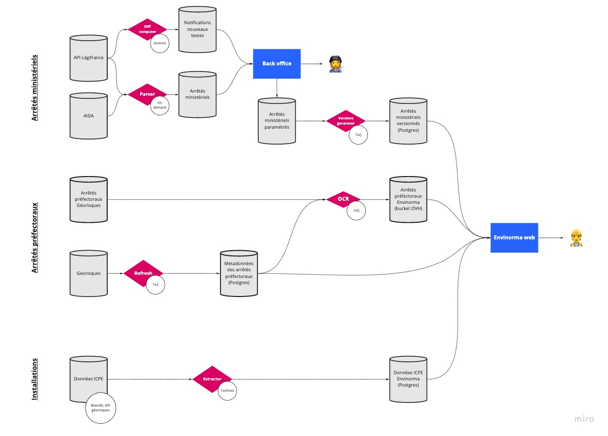

# Data tasks

Ce dépôt contient l'ensemble des tâches de préparation de la donnée nécessaire au lancement de l'application [Envinorma](https://github.com/Envinorma/envinorma-web)

Ces tâches sont décrites ci-dessous:



Les points d'entrée sont définis dans le fichier [tasks/flows.py](tasks/flows.py).

# Planifier et exécuter les tâches

Les tâches sont destinées à être exécutées dans le même environnement et sont orchestrées par [Prefect](http://prefect.io).

## Usage

Pour exécuter l'agent qui planifie et exécute à son tour les tâches :

```sh
git clone https://github.com/Envinorma/data-tasks
cd data-tasks
# Fill config.ini with required credentials, see default_config.ini for template.
docker build -t envinorma-data-tasks .
docker run -it --rm -e PYTHONPATH='/usr/src/app' -e STORAGE_SEED_FOLDER='/data/seed' -e STORAGE_AM_REPOSITORY_FOLDER='/data/repo' envinorma-data-tasks
```
